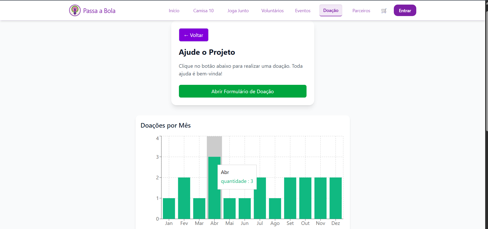
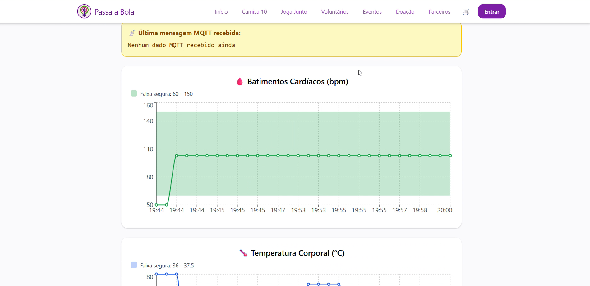
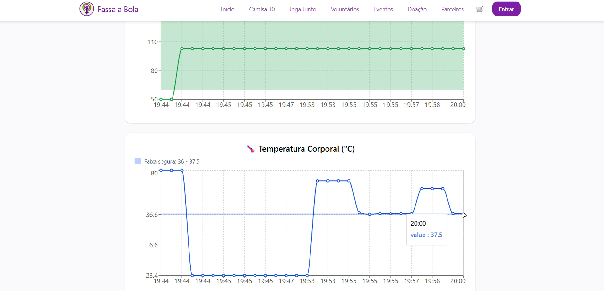
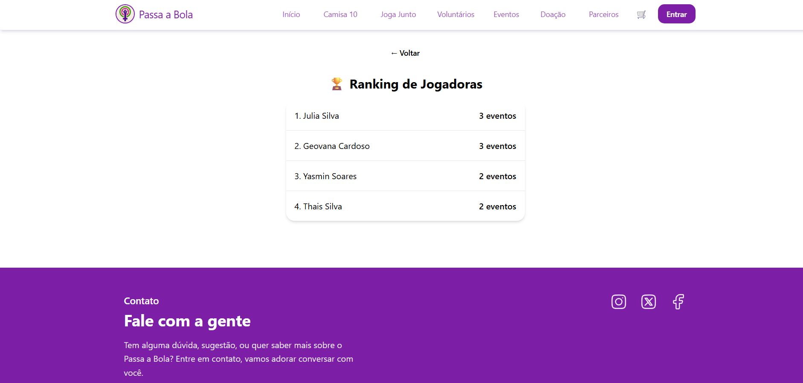

# Passa a Bola

## Visão Geral

O Passa a Bola é uma plataforma web completa desenvolvida pela equipe SmoothPath, que conecta organizadoras de eventos esportivos, jogadoras, fãs e voluntárias.  
A aplicação permite cadastro, inscrição e gerenciamento de eventos esportivos comunitários, além de oferecer ranking de jogadoras, painel administrativo, notícias e placares atualizados do futebol feminino.

O projeto une tecnologia web moderna, integração com sistemas IoT (Cinta Monitora) e processamento de dados em Python, formando um ecossistema inteligente que promove organização, engajamento e segurança esportiva.

---

## Equipe SmoothPath
- Geovana Maria da Silva Cardoso - 566254  
- Gabriel dos Santos Cardoso - 561203  
- Gustavo Torres Caldeira - 561613  
- Lucas Oliveira Santos - 563617  
- Mariana Silva do Egito Moreira - 562544  
- 1ESPF - Engenharia de Software  

---

## Funcionalidades Principais

### Usuárias (Jogadoras)
- Cadastro e login seguro com autenticação JWT  
- Edição de perfil e acompanhamento de pontuação  
- Inscrição e cancelamento em eventos  
- Acesso ao ranking de jogadoras  
- Visualização de notícias e placares atualizados do futebol feminino  

### Administradoras
- Painel administrativo completo  
- CRUD de eventos e postagens (criação, edição, exclusão e listagem)  
- Postagens aparecem automaticamente na Home  
- Gerenciamento de inscrições e status de eventos  
- Exportação de relatórios de participantes  

### Home da Plataforma
- Exibição dinâmica de postagens das administradoras  
- Seção com notícias e placares ao vivo do futebol feminino  

---

## Recursos Extras
- Mapa interativo (Leaflet)  
- Carrinho de produtos personalizados
- Seção de Doações para voluntários
- Sistema de pontuação e engajamento
- Seção de Parceiros
- Interface responsiva e acessível, feita com Tailwind CSS  

**Gráfico da quantidade de Doações do Mês**


---

## Integração IoT – Cinta Monitora “Passa a Bola”

A Cinta Monitora IoT é um dispositivo vestível criado para monitorar a saúde das atletas durante treinos e jogos.  
Ela coleta dados fisiológicos em tempo real e envia para o FIWARE, integrando-se com a plataforma web.

### Componentes e Tecnologias
- ESP32, DHT22 (temperatura corporal) e potenciômetro (simulação de batimentos)  
- Buzzer para alertas locais  
- Comunicação via MQTT com o FIWARE Orion Context Broker  
- Mosquitto, IoT Agent MQTT, STH-Comet e MongoDB para armazenamento e histórico  

### Funcionalidades IoT
- Coleta contínua de batimentos, temperatura e calorias  
- Envio de dados em tempo real ao FIWARE  
- Alertas sonoros e visuais em situações críticas  
- Armazenamento e exibição histórica dos dados no painel da plataforma  

**Exemplo de Gráficos de Monitoramento IoT**  
  
  

---

## Módulo Python – Cálculo de Ranking

O sistema de ranking é desenvolvido em Python, responsável por processar as informações de participação, engajamento e pontuação das jogadoras.

### Funcionamento
1. O script Python coleta os dados de pontuação e engajamento.  
2. Calcula o ranking geral e individual das jogadoras.  
3. Gera um arquivo JSON com os resultados atualizados.  
4. O Node.js consome esse arquivo e envia os dados ao frontend React, que exibe o ranking no site.

**Exemplo do Ranking (Python)**  
  

---

## Tecnologias Utilizadas

### Backend
- Node.js + Express.js  
- JWT e Bcrypt.js  
- Integração com Python via JSON  
- Conexão com FIWARE e MQTT  

### Frontend
- React.js + Vite  
- Tailwind CSS  
- Context API + Axios  

### IoT e FIWARE
- ESP32, DHT22, Buzzer  
- MQTT, Mosquitto, IoT Agent MQTT  
- FIWARE Orion, STH-Comet, MongoDB  

### Python
- Processamento de ranking  
- Geração de JSONs para integração com Node.js  
- Biblioteca Pandas para manipulação de dados  
---

## Execução do Sistema

### Backend
```bash
cd backend
npm install
node server.js
```

### Frontend
```bash
cd frontend
npm install
npm run dev
```
## Acesso ao Projeto

- GitHub: [https://github.com/SmoothPath/PassaBola.git](https://github.com/SmoothPath/PassaBola.git)  
- Deploy (Vercel): [https://passa-bola-8d13.vercel.app/](https://passa-bola-8d13.vercel.app/)

---

## Conclusão

O Passa a Bola é uma solução digital completa que integra web, IoT e análise de dados para promover o futebol feminino.  
O sistema foi totalmente implementado, com destaque para o painel administrativo funcional, cálculo automatizado de ranking em Python e monitoramento em tempo real via IoT e FIWARE.  
A plataforma está pronta para deployment e expansão futura, representando um marco de inovação no esporte comunitário.
